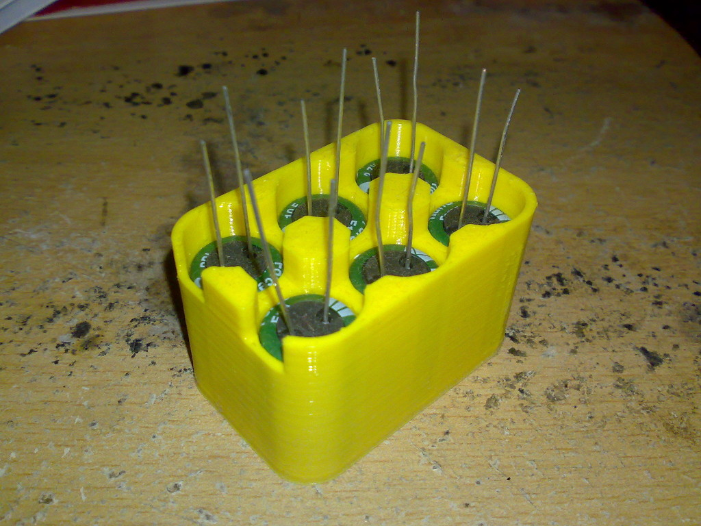

# Capacitor Bank Housing

A housing to hold capacitors, it was primarily designed for super caps but any cap will fit.

## Configuration

- The diameter and height of the cap
- The number of rows and columns
