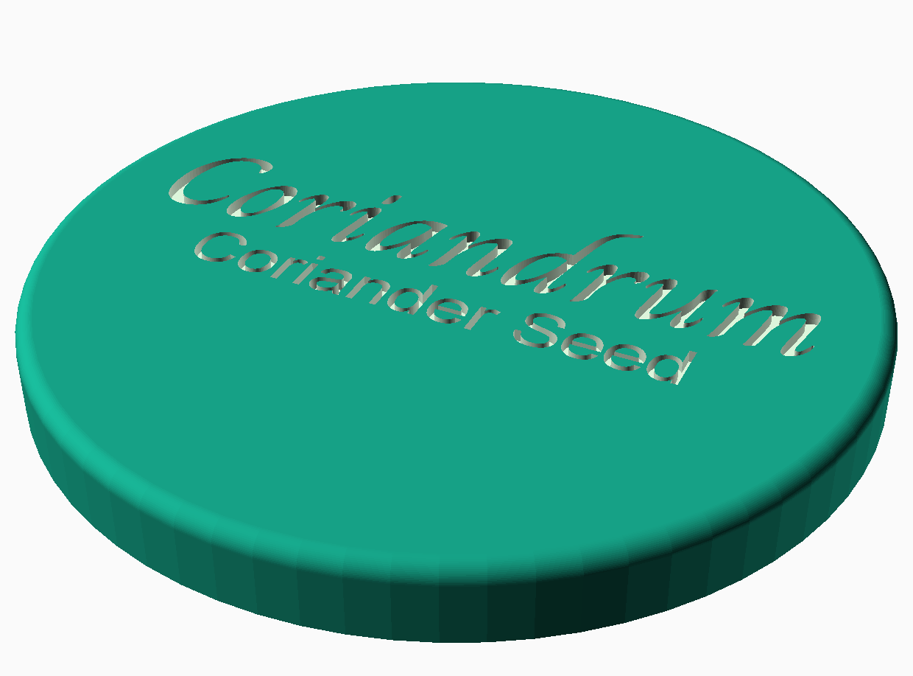

# Masala Tin Lids

Lids for the 67mm stainless steel spice jars that go in a masala tin. They are a snap fit but there is some variance in the manufacture of the jars, the `adjustment` variable can be used to adjust the size.
Each has a label embossed in the top, the top line is designed to have the Latin name and then the common name below.

## Fonts

- [Charm](https://fonts.google.com/specimen/Charm?selection.family=Charm)
